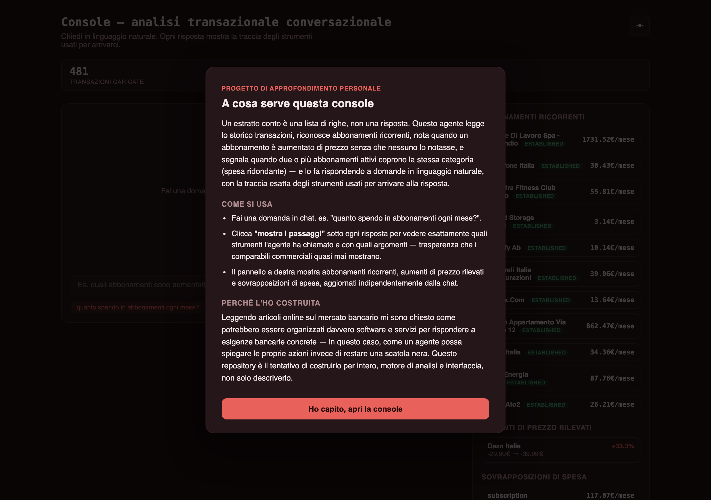
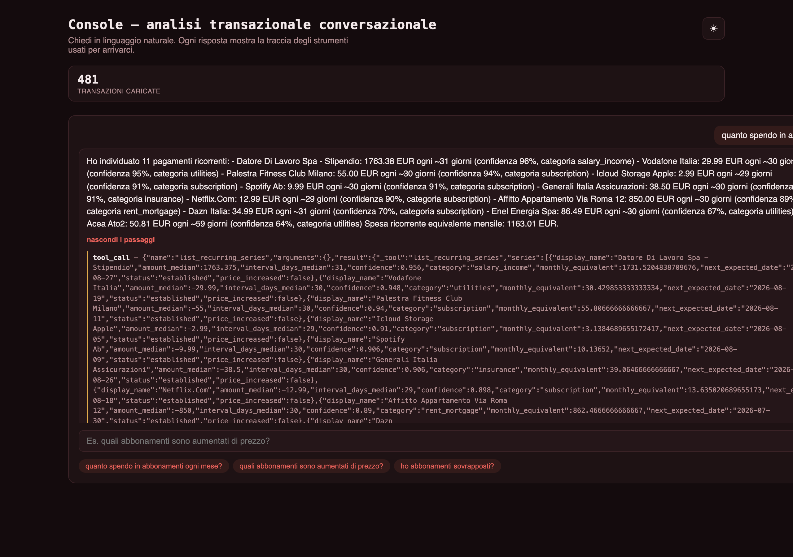

# transaction-intelligence-agent

Agente LLM con tool-calling per l'analisi conversazionale delle transazioni
di conto corrente: rilevamento pagamenti ricorrenti, aumenti di prezzo,
abbonamenti sovrapposti, categorizzazione, domande in linguaggio naturale
sulla spesa, conversazione multi-turno — con audit trail completo di ogni
chiamata a strumento, non solo della risposta finale.

[]()
[]()
[]()

## In breve

Leggendo articoli online sul mercato bancario mi sono chiesto come potrebbe essere
organizzato davvero un agente che risponde a domande sulle proprie spese in linguaggio
naturale — non solo "quanto ho speso questo mese", ma cose che nessuno controlla mai a
mano: quali abbonamenti sono aumentati di prezzo senza che me ne accorgessi, se ho due
abbonamenti che coprono la stessa cosa. Questo repository è la mia risposta: un agente
Python/FastAPI che usa strumenti reali (non solo un prompt) per rispondere, e mostra
esattamente quali strumenti ha chiamato per arrivare a ogni risposta — trasparenza che
la maggior parte delle app di finanza personale non offre.

**A cosa può servire**: è un esempio concreto di come costruire un agente LLM
ispezionabile sopra dati transazionali — utile per chi vuole vedere come si struttura un
tool-calling loop con audit trail, non solo leggerne la teoria.





---

## Problema

Il rilevamento automatico di abbonamenti e pagamenti ricorrenti dai dati
transazionali è un caso d'uso concreto e già in produzione nel settore
(analisi transazionale, categorizzazione intelligente, visibilità sulla
spesa ricorrente per il cliente). Questo repository ne implementa una
versione end-to-end: dal rilevamento statistico al layer conversazionale
con cui l'utente lo interroga in linguaggio naturale, con la tracciabilità
delle decisioni che un sistema del genere richiede quando opera su dati
finanziari di un cliente.

## Rispetto ai prodotti di categoria

Non un confronto per gonfiare il progetto: quattro segnali che i prodotti di
riferimento del settore trattano come feature di punta, e che la prima
versione di questo repository non calcolava affatto — non un tool
mancante nell'agente, mancava il dato a monte. Aggiunti in `docs/adr/0005`
e `docs/adr/0006` dopo una ricerca comparativa esplicita, non per intuito.

| Segnale | Chi lo ha | Cosa fa qui |
|---|---|---|
| Alert aumento prezzo abbonamento | Rocket Money (alert dedicati su price increase, canoni annuali dimenticati, servizi duplicati) | `RecurringSeries.price_increased`, tool `list_price_increases` — confronta primo vs ultimo addebito, soglia 5% |
| Status "early detection" vs maturo | Plaid Recurring Transactions (`early_detection` per stream con meno di 3 occorrenze, invece di ometterli) | `SeriesStatus.EARLY_DETECTION` — la serie è comunque restituita, mai nascosta fino a maturazione |
| Rilevamento abbonamenti sovrapposti/duplicati | Rocket Money ("potential duplicate charges") | `detection/duplicates.py`, tool `list_subscription_overlaps` — categorie con 2+ commercianti ricorrenti distinti |
| Memoria conversazionale multi-turno | Cleo 3.0 (2025-2026): memoria a lungo termine come feature di lancio | `TransactionAgent.ask(history=...)` + session store in `POST /chat` (`docs/adr/0006`) |

Fonti: [Plaid — Recurring Transactions](https://plaid.com/blog/recurring-transactions/) ·
[Rocket Money — subscription tracking](https://www.rocketmoney.com/learn/personal-finance/best-subscription-management-apps) ·
[Cleo 3.0 — memoria e voce](https://techintelpro.com/news/finance/financial-services/cleo-30-launches-as-ai-financial-coach-with-voice-and-memory)

## Architettura

```
┌─────────────┐    ┌──────────────────┐    ┌────────────────────────────┐
│  Synthetic   │───▶│  TransactionStore │───▶│  Detection layer            │
│  generator   │    │  (in-memory)      │    │  recurring · categorize ·   │
└─────────────┘    └──────────────────┘    │  duplicates (price/overlap) │
                             │                └────────────────────────────┘
                             ▼                        │
                    ┌──────────────────┐              │
                    │   ToolRegistry    │◀─────────────┘
                    │  (5 tool schemas) │
                    └──────────────────┘
                             ▲
                             │ tool_calls / results
                    ┌──────────────────┐     ┌──────────────────┐
                    │  TransactionAgent │◀───▶│  session store    │
                    │  (agent/core.py)  │     │  (multi-turno,     │
                    │  loop ReAct,      │     │   api/main.py)     │
                    │  max 4 step/turno │     └──────────────────┘
                    └──────────────────┘
                             ▲
                    ┌────────┴─────────┐
              ┌─────────────┐   ┌──────────────┐
              │   FakeLLM    │   │ OpenAIClient │
              │ (default,    │   │  (opzionale, │
              │  offline)    │   │  OPENAI_API_KEY) │
              └─────────────┘   └──────────────┘
```

Il livello di detection (`detection/recurring.py`, `detection/categorize.py`,
`detection/duplicates.py`) è deliberatamente **non-LLM**: regole esplicite e
statistica su intervalli e importi. L'agente conversazionale (`agent/`) è il
livello che interpreta la domanda dell'utente, sceglie quale strumento
chiamare e sintetizza la risposta — vedi `docs/adr/0002` per la motivazione
della separazione.

## Numeri misurati

Benchmark eseguito con `python scripts/demo.py` (dataset sintetico
riproducibile, seed=42, 12 mesi, 11 serie ricorrenti note come ground truth):

| Metrica | Valore |
|---|---|
| Transazioni generate | 481 |
| Tempo di rilevamento pagamenti ricorrenti | **~3,2 ms** per 481 transazioni (misurato su hardware locale, `time.perf_counter`; ordine di grandezza, non un SLA — dipende dalla macchina) |
| Precision rilevamento ricorrenze | **90,9%** (10/11) |
| Recall rilevamento ricorrenze | **90,9%** (10/11) |
| Aumento di prezzo rilevato | **1/1** — Dazn Italia iniettata nel dataset con salto 29,99→39,99 EUR al mese 6, rilevata con +33,3% |
| Abbonamenti sovrapposti rilevati | **1 categoria** (subscription: 5 commercianti, 117,07 EUR/mese) |
| Copertura test | **~96%** (100% su detection/categorize/normalize/duplicates/synthetic/llm, incluso il client OpenAI testato con SDK mockato via `sys.modules`) |
| Test totali | 63, tutti verdi |

La serie mancata su 11 è **Amazon Prime**, fatturazione annuale — non per un
punteggio di confidenza al limite (l'algoritmo non arriva nemmeno a
calcolarlo), ma per un limite strutturale dichiarato: il generatore produce
12 mesi di storico, un addebito annuale in quella finestra compare **una
sola volta**, e `MIN_OCCURRENCES = 2` in `detection/recurring.py` richiede
almeno due occorrenze per poter stimare un intervallo. Non è un bug e non è
nemmeno un caso ambiguo — è un vincolo noto e corretto: rilevare una cadenza
richiede di aver osservato la cadenza almeno una volta, cioè come minimo il
doppio dell'intervallo di fatturazione di storico. Con 13+ mesi di dati
Amazon Prime verrebbe rilevato al pari delle altre serie. La serie con
confidenza più bassa fra quelle *effettivamente* rilevate è invece Acea
Ato2 (64%, fatturazione bimestrale a 59 giorni anziché 60 esatti, importo
variabile per consumo) — sopra la soglia minima di 0,55 ma un caso
genuinamente borderline, quello sì.

## Console chat (interfaccia)

`make serve` espone anche una console a `http://localhost:8004/` (HTML/JS
statico, nessuna build): chat conversazionale con **traccia degli
strumenti ispezionabile** dietro un clic su ogni risposta — quale tool
l'agente ha chiamato, con quali argomenti, cosa ha restituito — trasparenza
che né Cleo né Rocket Money espongono all'utente finale. A fianco, un
pannello sempre aggiornato con abbonamenti ricorrenti (badge
`established`/`early_detection` stile Plaid), aumenti di prezzo rilevati e
sovrapposizioni di spesa, indipendente dalla chat. Una modale al primo
accesso spiega cosa fa la console e perché esiste, persistita in
`localStorage`. Tema chiaro/scuro con palette dedicata (corallo/rosa, non
il verde-denaro scontato di ogni app di finanza personale).

## Come si esegue

```bash
git clone <repo> && cd transaction-intelligence-agent
make install
make demo     # genera dati, rileva ricorrenze/aumenti/doppioni, esegue 6 query all'agente — nessuna chiave API richiesta
make test     # 61 test, coverage report
make serve    # FastAPI su http://localhost:8000
              #   POST /chat (con session_id per continuare la conversazione)
              #   GET  /recurring · /price-increases · /subscription-overlaps
              #   GET  /healthz
```

Oppure via Docker: `docker compose up --build`.

Per usare un vero modello invece di `FakeLLM`, basta esportare
`OPENAI_API_KEY` prima di `make serve` — l'agente lo rileva automaticamente
(`docs/adr/0001`), nessun'altra modifica necessaria.

## Cosa ho imparato / limiti noti

- **`FakeLLM` non generalizza.** È un router a keyword, non un modello: fuori
  dalle query previste risponde onestamente "non ho capito", non con vera
  comprensione del linguaggio. È una scelta dichiarata (demo riproducibile,
  zero costi/chiavi) non un tentativo di spacciarlo per un LLM vero — vedi
  `docs/adr/0001`. Prima versione di questo router aveva un fallback che
  chiamava comunque `list_recurring_series` su qualunque query non
  riconosciuta: tecnicamente "non crashava mai", ma su un topic sbagliato
  rispondeva con sicurezza invece di ammettere di non aver capito — peggio
  di un errore esplicito su dati finanziari di un cliente. Corretto perché
  emerso rileggendo il codice, non perché segnalato da un test che ne
  verificasse solo la non-vuotezza della risposta.
- **Una chiamata a strumento non deve mai poter far crashare l'intera
  richiesta.** `ToolRegistry.dispatch` inizialmente propagava `ValueError`
  se un modello (reale, non `FakeLLM`) passava una categoria fuori
  dall'enum, o `TypeError` su un argomento inventato — scenari realistici
  con un vero LLM, non solo teorici. Ora ogni eccezione di chiamata è
  catturata e trasformata in un risultato di errore strutturato che il
  modello (o `FakeLLM._synthesize`) può leggere e su cui rispondere in modo
  onesto, invece di un 500 senza spiegazione — vedi `tests/test_tools.py`.
- **Il rilevamento ricorrenze è tarato su dati europei/italiani** (fatturazione
  mensile prevalente, poche annuali). Fatturazioni settimanali o con jitter
  di calendario più ampio del testato richiederebbero di ricalibrare
  `MAX_INTERVAL_CV`.
- **Serve almeno il doppio dell'intervallo di fatturazione in storico per
  rilevare una cadenza** (vedi la nota su Amazon Prime sopra) — non un bug,
  ma un vincolo che vale la pena rendere esplicito prima che lo scopra un
  revisore.
- **Nessun dato bancario reale è stato usato.** Tutto il dataset è generato
  sinteticamente (`data/synthetic.py`), seed fisso per riproducibilità. Include
  ora anche un caso positivo deliberato di aumento prezzo (Dazn Italia,
  29,99→39,99 EUR al mese 6) — senza un ground truth positivo, un tool come
  `list_price_increases` potrebbe restituire sempre lista vuota su questo
  dataset e nessun test se ne accorgerebbe.
- **Non c'è persistenza.** `TransactionStore` è in-memory per tenere il
  progetto leggibile end-to-end in un'unica lettura; la migrazione a un
  repository Postgres-backed è dichiarata come estensione naturale in
  `docs/adr/0003`, a interfaccia invariata. Lo stesso vale ora per il session
  store della memoria conversazionale (`docs/adr/0006`) — `dict` in-process,
  limitato a 20 messaggi per sessione, non sopravvive a un riavvio.
- **Aggiungere la memoria multi-turno ha scoperto un bug nel loop esistente,
  non solo richiesto codice nuovo.** `TransactionAgent.ask` non appendeva mai
  la risposta finale dell'assistente a `messages` prima di restituire — invisibile
  finché ogni chiamata partiva da zero, ma avrebbe rotto silenziosamente
  qualunque secondo turno costruito su quel transcript (il modello avrebbe
  visto la domanda e i tool-call intermedi, mai cosa aveva risposto). Trovato
  implementando `docs/adr/0006`, non da un test preesistente.

## Decisioni architetturali

- [`ADR-0001`](docs/adr/0001-agnostic-llm-provider.md) — perché l'agente non dipende da un vendor LLM specifico
- [`ADR-0002`](docs/adr/0002-rule-based-categorization-not-llm.md) — perché la categorizzazione è a regole e non delegata all'LLM
- [`ADR-0003`](docs/adr/0003-tool-schema-and-audit-trail.md) — schema dei tool condiviso e trace come audit trail
- [`ADR-0004`](docs/adr/0004-tool-dispatch-never-raises.md) — perché una chiamata a strumento fallita non deve mai interrompere il loop dell'agente
- [`ADR-0005`](docs/adr/0005-competitor-parity-signals.md) — tre segnali aggiunti per parità con i prodotti di categoria (Plaid, Rocket Money)
- [`ADR-0006`](docs/adr/0006-multi-turn-conversation-memory.md) — memoria conversazionale multi-turno (Cleo)
- [`ADR-0007`](docs/adr/0007-no-redis-no-blockchain.md) — perché Redis e blockchain non servono qui, e cosa cambierebbe multi-istanza

## Nel contesto del portfolio

Questo repo è uno dei sette progetti di
[`banca-sandbox`](https://github.com/lobbenedesign/banca-sandbox), un
ecosistema di sistemi bancari agganciati alle normative su cui gli AI/IT
team delle banche italiane stanno investendo: instant payments (ISO 20022 +
Verification of Payee), credit scoring conforme all'AI Act, resilienza DORA,
antifrode su grafo, open banking PSD3. Ogni repo condivide lo stesso
standard: numeri misurati, non aggettivi; ADR per ogni decisione non ovvia;
`make demo` come unico comando richiesto per vedere il sistema funzionare.
